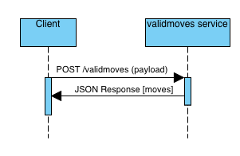

# validmoves
## Start server
source venv/bin/activate

# Install dependencies
pip install -r requirements.txt

# Launch server
# If nothing else is running on port 5000
flask run

# If you are running another flask server you will have to override the port. for example
flask run --port=31337


Payload Example for microservce:
```json
{
    "threshold": 8,
    "field": "start_up",
    "moves": {
        "move1": {"start_up": 5, "active": 55, "recovery": 5, "on_hit": 5},
        "move2": {"start_up": 6, "active": 66, "recovery": 6, "on_hit": 6},
        "move3": {"start_up": 7, "active": 77, "recovery": 7, "on_hit": 7},
        "move4": {"start_up": 8, "active": 88, "recovery": 8, "on_hit": 8},
        "move5": {"start_up": 9, "active": 99, "recovery": 9, "on_hit": 9},
    }
}
```

Example REST POST call to the microservice in Python
```
import requests

moves = {
    "move1": {"start_up": 5, "active": 55, "recovery": 5, "on_hit": 5},
    "move2": {"start_up": 6, "active": 66, "recovery": 6, "on_hit": 6},
    "move3": {"start_up": 7, "active": 77, "recovery": 7, "on_hit": 7},
    "move4": {"start_up": 8, "active": 88, "recovery": 8, "on_hit": 8},
    "move5": {"start_up": 9, "active": 99, "recovery": 9, "on_hit": 9},
}
payload = {
    "threshold": 8,
    "field": "start_up",
    "moves": moves
}

res = requests.post('http://localhost:31337/getmoves', 
                    json=payload)
```


##UML
